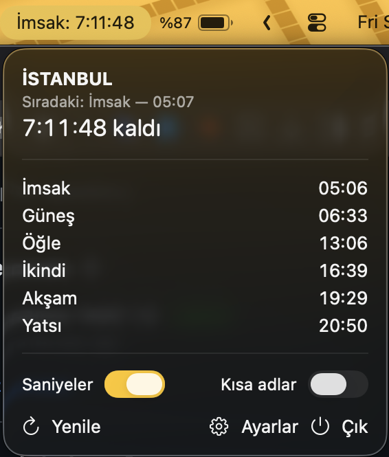

# Namaz Vakti

macOS menü barında bir sonraki namaz vaktine kalan süreyi gösteren sade bir uygulama. Pencere yok, Dock ikonu yok, bildirim yok. Menü barında sadece şu var:

```
İkindi: 1:23:45
```


Tıklayınca açılan panel:




*English below.*

## Özellikler

- Menü barında sıradaki vakit ve saniyeli geri sayım (`İkindi: 1:23:45`)
- Saniyeler kapatılabilir: o zaman saat:dakika gösterilir (`İkindi: 1:23`), son 5 dakikada yine saniye akar (`0:04:59`)
- Tıklayınca saniyeli geri sayım ve günün tüm vakitleri (İmsak, Güneş, Öğle, İkindi, Akşam, Yatsı), sıradaki vurgulu
- **Ülke → şehir → ilçe** seçimi (Diyanet verisi)
- **Türkçe / English** arayüz
- İsteğe bağlı kısaltılmış vakit adları (`İkn: 1:23:45`)
- Girişte başlat
- Aylık vakitler diske kaydedilir, internet yokken de geri sayım çalışır
- Hesap, kayıt, API anahtarı yok

## Kurulum

### Hazır DMG

[Releases](https://github.com/fatihtemiz/namaz-vakti-menubar/releases) sayfasından son DMG'yi indirin ve uygulamayı **Applications** klasörüne sürükleyin.

Uygulama Developer ID ile imzalı ve Apple tarafından notarize edilmiştir; açılırken güvenlik uyarısı çıkmaz.

### Kaynaktan derleme

Gerekenler: macOS 14+, Xcode Komut Satırı Araçları (Swift 6).

```bash
git clone https://github.com/fatihtemiz/namaz-vakti-menubar.git
cd namaz-vakti-menubar
./build_app.sh install
```

`./build_app.sh` tek başına `NamazVakti.app` ve `dist/` altına bir DMG üretir. `install` ile ayrıca `~/Applications`'a kurar ve başlatır. Geliştirirken hızlı çalıştırmak için: `swift run`.

### İmzalama ve notarize (geliştirici için)

Build betiği anahtar zincirinde bir **Developer ID Application** sertifikası bulursa uygulamayı onunla imzalar. `namazvakti-notary` adlı bir notarytool profili de varsa uygulamayı ve DMG'yi Apple'a notarize ettirip onay damgasını ekler. İkisi de yoksa ad-hoc imzalar. Bir kerelik kurulum (ücretli Apple Developer üyeliği gerekir):

1. Xcode → Settings → Accounts → takımınız → **Manage Certificates** → **+** → **Developer ID Application**
2. [account.apple.com](https://account.apple.com) → Oturum Açma ve Güvenlik → **Uygulamaya Özel Parolalar** → yeni parola oluşturun
3. Profili kaydedin (parolayı sorar, anahtar zincirine yazar):

```bash
xcrun notarytool store-credentials namazvakti-notary --apple-id <apple-id-e-postanız> --team-id <TEAM_ID>
```

## Kullanım

1. Menü barındaki `Ayarla…` yazısına tıklayın ve **Ayarlar**'ı açın.
2. Ülke / Şehir / İlçe seçip **Kaydet**'e basın.
3. Vakitler çekilir, geri sayım başlar.

## Veri kaynağı

Vakitler **[EzanVakti API](https://ezanvakti.emushaf.net/)** üzerinden alınır (Diyanet İşleri Başkanlığı verisi). Bu servis bu projeye ait değildir; gönüllü olarak işletilen, kimlik doğrulama gerektirmeyen bir servistir. Uygulama ayda bir istek atar ve sonucu saklar. Servis kapanırsa uygulama yeni vakit alamaz.

## Mimari

| Dosya | Görevi |
|------|--------|
| `NamazVaktiApp.swift` | `MenuBarExtra` sahnesi + accessory (Dock'suz) politika |
| `PrayerTimesManager.swift` | Cache, 1 sn'lik geri sayım timer'ı, sıradaki vakit hesabı |
| `EzanVaktiAPI.swift` | EzanVakti REST istemcisi (auth yok) |
| `Models.swift` | API modelleri, vakit adları, diske cache modeli |
| `Localization.swift` | `AppLanguage` + `loc("Türkçe", "English")` yardımcısı |
| `ContentView.swift` | Menü bar açılır paneli |
| `SettingsView.swift` | Dil, girişte başlat ve ülke/şehir/ilçe seçimi |
| `Scripts/make_icon.swift` | Uygulama ikonunu kodla çizer, build sırasında `.icns` olur |

### API uçları (hepsi GET, kimlik doğrulama yok)

- `ulkeler` → `{ UlkeAdi, UlkeAdiEn, UlkeID }`
- `sehirler/{UlkeID}` → `{ SehirAdi, SehirAdiEn, SehirID }`
- `ilceler/{SehirID}` → `{ IlceAdi, IlceAdiEn, IlceID }`
- `vakitler/{IlceID}` → aylık liste: `{ Imsak, Gunes, Ogle, Ikindi, Aksam, Yatsi, MiladiTarihKisaIso8601, … }`

## Notlar / bilinen sınırlar

- Vakitler seçilen ilçenin yerel saatidir; geri sayım Mac'inizin aynı saat diliminde olduğunu varsayar.
- İnternet yokken son kaydedilen ay üzerinden geri sayım çalışmaya devam eder.
- `vakitler` ucu içinde bulunulan **ayı** döndürür; uygulama gün dönümünde ve ay sonunda otomatik yeniden çeker.

## Lisans

MIT, bkz. [LICENSE](LICENSE).

---

## English

A minimal macOS menu bar app that shows the time left until the next prayer. No window, no Dock icon, no notifications. Just this in your menu bar:

```
Asr: 1:23:45
```


- Next prayer and a live countdown in the menu bar (`Asr: 1:23:45`)
- Seconds can be turned off: it then shows hours:minutes (`Asr: 1:23`), with seconds only in the last 5 minutes (`0:04:59`)
- Click it for a to-the-second countdown and today's full schedule, with the next prayer highlighted
- Country → city → district picker, using official Diyanet (Presidency of Religious Affairs, Türkiye) times
- Turkish / English interface (Settings → General)
- Optional abbreviated names, launch at login
- Monthly times are cached on disk, so the countdown keeps working offline
- No account, no sign-up, no API key

**Install:** download the DMG from [Releases](https://github.com/fatihtemiz/namaz-vakti-menubar/releases) and drag the app into Applications. The app is signed with a Developer ID and notarized by Apple, so it opens without security warnings.

**Build from source** (macOS 14+, Swift 6):

```bash
git clone https://github.com/fatihtemiz/namaz-vakti-menubar.git
cd namaz-vakti-menubar
./build_app.sh install
```

**Data:** prayer times come from the community-run [EzanVakti API](https://ezanvakti.emushaf.net/), which serves Diyanet data. It is not affiliated with this project. Times are the selected district's local times; the countdown assumes your Mac is in the same time zone.

**License:** MIT
